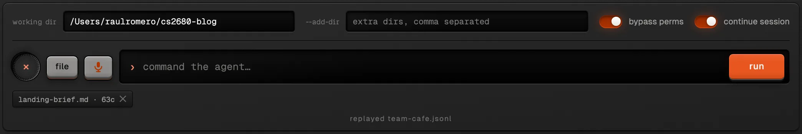

Agent interfaces are increasingly leaning towards the complete autonomous creation of software, to
an extent that the user is less in the loop. In 2022, GitHub Copilot gave users code
completion. In 2023, Cursor began introducing file-level edits. In 2024, v0 introduced
cloud-based creation of projects tested in its own sandbox. And since November 2025, Claude Code and
Codex have meaningfully increased not just model capabilities but their usefulness in coding
harnesses. While the trend has meant that users are able to leverage these interfaces to create
longer-running tasks and shift towards goal engineering, in certain use cases users want to be in
control, even if their agents are generating all the code.



This long tweet from Karpathy captures the essence. Agents have rendered what used to be meaningful
architecture decisions obsolete, often keeping the user out of the loop by choosing the standard or
following their preferences. This is valuable. But it has shifted the decisions that users should
control in order to maximize the quality of outputs from their agents and their steerability, such
as: How many sub-agents should be created at once? What are the patterns that the agent should
refer to when creating a design? How should it use the browser to test the page? How much effort
should be spent on a task? How should an agent team be set up?

As a design engineer who runs agentic workflows on a daily basis (see below), deciding how to
control (or not), what to control, and when to make that decision is key.



So, with the advice of my professor Juncheng Yang and TF Yiyu Liu, I created a Teenage
Engineering-inspired Claude Code terminal (called ‘Controller’) that provides visible knobs that
allow users to reduce the amount of prompting they do and quickly take relevant actions. It merges
the elements of Claude Code with physical levers users can use, and gives them visibility into
their usage, consumption and model.

This visual identity and the manual knobs provide a more bespoke experience that can give design
engineers (and developers in general) a different feel of the model, and an experience that feels
easier to manage, with lower cognitive load than prompting every adjustment.

At the top, users can observe consumption and model, and can easily instruct Claude Code to merge
the changes into main.

On the left column, the menu provides users the ability to more easily tweak the number of
sub-agents and agents they would require (or the max number of agents available) for either the
conversation or a given turn.

On the left, users can manage the number of agents and sub-agents and can search for skills that
they'd like to adopt in the instance.

At the bottom, users can manage the files, provide input with audio, or manage the directory.

[Explore Controller here](https://github.com/HarvardMadSys/CS2680-Assignment1-Mads-Lens/tree/main/controller).

## AI use

Controller was built with Claude Code (Claude Opus 5.5). GPT-6 Astra 3D modelled the Controller
design in Blender that Controller's texture was developed from.
