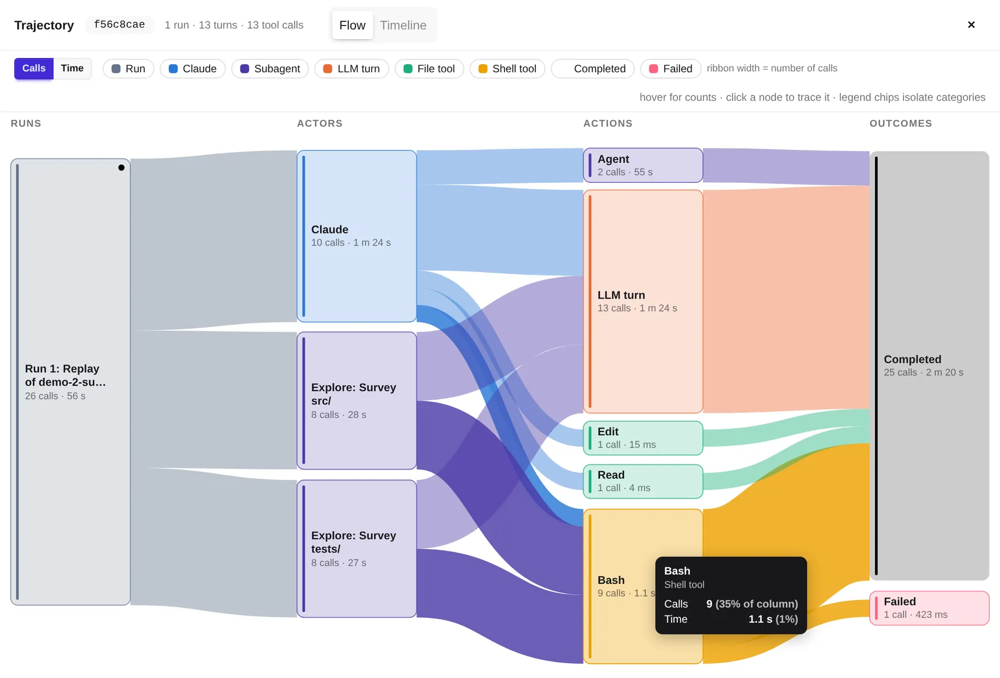
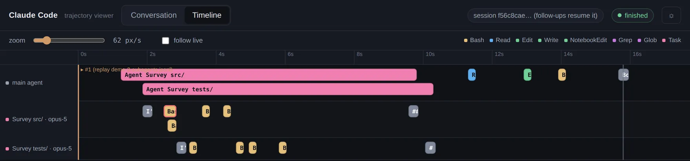

A coding agent can read files, run commands, and delegate tasks faster than a person can
follow its conversation. Watching the tool calls arrive is useful, but supervising the work
also means understanding who is responsible for each task, which activities take time, and
how to guide the next run.

For Assignment 1 in CS2680, students built web interfaces around Claude Code's headless mode.
The assignment called for streamed tool calls and their status, run costs, follow-up messages
in the same session, nested subagent activity, and an outline of the run.

Across the 68 demos we reviewed, a common design emerged: a conversation with collapsible
tool-call cards, an outline alongside it, and a cost display. The six projects below explore
additional ways to organize that information. Each makes a different part of the agent's
work easier to understand.

You can explore all six in the
[Mads Lens collection](https://github.com/HarvardMadSys/CS2680-Assignment1-Mads-Lens). Each app
includes recorded runs or a demo mode, so you can try its interface without installing Claude
Code or consuming Claude usage.

<!--more-->

## Three questions for an agent interface

A chronological log preserves the sequence of events. An interface can organize those same
events around the questions a person brings to the run:

- **Who is doing what?** Show each subagent's assignment, progress, and returned result.
- **Where does the time go?** Make long calls and overlapping work visible, and distinguish
  call frequency from duration.
- **What can I control?** Keep model, effort, and delegation settings visible alongside the
  work they influence.

These questions provide three ways to read the projects below.

## Making delegation visible

### Subagents as a team by Saul Richardson

Saul Richardson gives each delegate a place in the interface. A row of cards above the
conversation shows the main session and its subagents, including each agent's status and
current activity. Selecting a delegate opens a focused view of its assignment, tool calls,
usage, and report.

This makes it possible to follow one task without searching through the entire run. The
interface also clarifies where a follow-up message will go: the composer replies to the main
session, even when a delegate is selected. Inspecting a subagent does not open a separate
conversation with it.

Try it: [`subagents-as-a-team/`](https://github.com/HarvardMadSys/CS2680-Assignment1-Mads-Lens/tree/main/subagents-as-a-team)

### Patchwork by Djordje Ivanovic

Djordje Ivanovic's Patchwork makes the handoffs between agents explicit. Each agent has a
name, an avatar, and a column in the Lanes view. The lead's column records the tasks it
assigned and the results it received. A subagent's column starts with its assignment and ends
with the result it handed back.

The view also compresses repetitive activity. Thirteen file reads can become a single group
describing the inspection, while failed steps appear under *Steps needing attention*. This
helps a reader follow the work at the level of tasks and outcomes, then open individual calls
when the details matter.

Patchwork's columns are compact summaries. Their vertical positions do not represent elapsed
time, a distinction the interface states directly.

Try it: [`patchwork/`](https://github.com/HarvardMadSys/CS2680-Assignment1-Mads-Lens/tree/main/patchwork)

### Fork View by Zoe Jingyi Liu

Zoe Jingyi Liu makes delegation part of the conversation's layout. When subagents work in
parallel, the log splits into columns, each showing an agent's brief, step count, and duration.
Further delegation appears inside the parent agent's column, preserving the relationship
between a task and the work it creates.

The layout helps a reader follow branches of the run without losing their place in the
larger task. Fork View also distinguishes incomplete information from a finished result:
during streaming, cost is shown as a lower bound, such as `≥$0.2496`; when the final result
arrives, the header shows the reported total. If the user stops a run, the interface explains
that everything recorded so far is retained.

Try it: [`fork-view/`](https://github.com/HarvardMadSys/CS2680-Assignment1-Mads-Lens/tree/main/fork-view)

## Understanding time and parallel work

### Sankey Flow by Ibrahim Khaliliya

Ibrahim Khaliliya organizes a run as a flow from agents to actions to outcomes. The Sankey
diagram connects the main agent and its subagents to activities such as model turns, shell
commands, file reads, and edits, then shows whether those activities completed or failed.

Band widths can represent either action counts or accumulated time. The action count includes
both tool calls and model turns. Switching between counts and time reveals how different
those measures can be: in the recording below, Bash accounts for 35% of actions but only about
1% of the accumulated time shown. Frequent activity need not be expensive in time.

The time view sums activity durations, which can overlap or include time spent waiting for
subagents. It should therefore be read as an activity breakdown, not as a partition of the
run's wall-clock duration. Hovering reveals the values behind a band, and failed outcomes
remain visible so a reader can trace them back to the relevant activity.

During live runs, the interface also shows gauges for time to first token and time per output
token. An animated cat responds to the token rate, giving the run's pace a playful visual cue.

Try it: [`sankey-flow/`](https://github.com/HarvardMadSys/CS2680-Assignment1-Mads-Lens/tree/main/sankey-flow)

### Swimlanes by Eric Gong

Eric Gong places each agent on a shared time axis. In the Timeline tab, each call is a block
positioned and sized using the interface's observed event times. Work happening at the same
time lines up across lanes; a long call occupies more horizontal space.

The timeline shows this relationship: the main agent's delegation calls span the same
seconds as the tool activity in its subagents' lanes. The timeline makes overlap directly
visible. In a replay, those seconds reflect playback timing; accelerated playback changes
the displayed durations. A zoom slider, live following, and links to each call's input and
output support both watching a run and inspecting it afterward.

Swimlanes also exposes model selection for the main agent and a policy for subagent models,
passed to the agent as a prompt instruction. When the events include an explicit request, a subagent can
show both its requested model and the model reported by the run, helping the user compare
the request with what happened.

Try it: [`swimlanes/`](https://github.com/HarvardMadSys/CS2680-Assignment1-Mads-Lens/tree/main/swimlanes)

## Keeping controls in view

### Controller by Raul Romero

Raul Romero takes inspiration from Teenage Engineering's music hardware. Controller presents
an effort knob, model keys, a fader for the requested maximum number of concurrent subagents,
and a delegation switch. Readouts for cost, elapsed time, turns, and calls sit beside the
live activity.

The controls make the requested configuration easy to inspect before and during a run. A
radial display complements them: the main agent sits at the center, with a satellite for each
subagent and a label showing its call count. Together, the controls and display let a user
compare the requested delegation with the agents that appear in the run.

Try it: [`controller/`](https://github.com/HarvardMadSys/CS2680-Assignment1-Mads-Lens/tree/main/controller)
