Assignment 1 asked everyone to put a web page in front of Claude Code's headless mode. Type a
prompt; watch the agent's tool calls stream in with their status; see what the run cost; send
a follow-up in the same session; find each subagent's work nested under the call that started
it; and get an outline of the whole trajectory.

We went through all 68 demos. Most built the same sensible thing: a chat-like log of
collapsible tool-call cards, an outline beside it and a cost line underneath, much like the
assignment's mockup. That is a perfectly good answer. The eleven designs below went further. Each one asks what the person supervising an agent actually needs to see, and answers
with something a log of tool calls can't show on its own.

<!--more-->

## What a log of tool calls hides

A log shows what happened, in order. Five things are hard to see in it:

- **Time.** A call that took 4 ms looks the same as one that took 40 s.
- **Failure.** A failing test, a broken tool, a refused permission and a call that never ran
  all turn red.
- **Intent.** You see what the agent did, not what it was trying to do.
- **Delegation.** A subagent becomes an indented block, not a worker with an assignment and a
  result.
- **Control.** When the agent needs a decision, headless mode says no on your behalf.

The sections below take these one at a time.

## Where the time went

### Yide Bian

Yide Bian's viewer reads a run as a series of steps. Each step is headed by the sentence the
agent wrote before acting ("No CLI tests exist yet, so I'll create tests/test_cli.py. First
the failing test (RED)."), and each call under it gets a single row with a one-line outcome:
`wrote 14 lines`, `+19 −11`, `1 failed, 4 passed`. You rarely need to open the output. Calls
that the permission gate turned away are marked *refused* rather than lumped in with errors,
and the outline on the right draws them dashed.

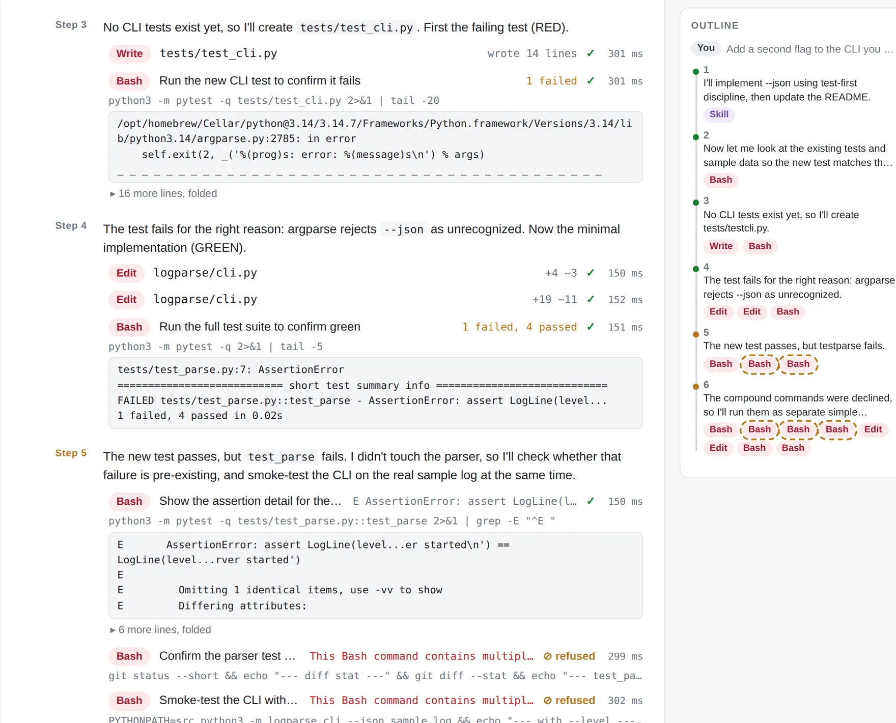

Each run ends with a timeline of where the time went, one lane per agent, and a sentence that
adds it up. In a three-minute run that added a `--json` flag to a small CLI, test first, the
tools on the critical path took 4.0 of the 178.5 seconds. Model thinking between calls took
143.6, and startup and the final answer the remaining 30.9. Faster tools would barely have
changed this run; fewer turns would have. With parallel subagents the sentence also says how
much time the overlap saved, and the run summary splits the cost by model.

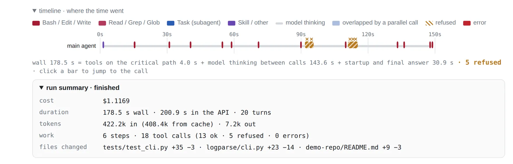

### Ibrahim Khaliliya

Ibrahim Khaliliya swapped the outline for a Sankey diagram. A run flows into its actors (the
main agent and each subagent), then into the actions they took (LLM turns, Bash, Read, Edit,
Agent), then into outcomes. Band width counts calls, or time at the flip of a toggle, and
hovering a node gives its share of both. In the run below, Bash is 35% of the calls and 1% of
the time; the minutes go to the LLM turns. A failed call becomes its own outcome, and you can
trace it back through the diagram.

The rest of the page leans the same way, with gauges for time to first token and time per
output token, and an animated cat that sleeps, waits, walks or runs with the token rate.

. Hovering Bash: 9 calls, 35% of the column, but 1.1 s, 1% of the time.")

### Eric Gong

Eric Gong's viewer adds a Timeline tab with one swimlane per agent. Each call is a block
placed at its real start time and sized by its duration, so two subagents working at once
show up as two lanes busy in the same seconds, and a slow call looks slow. A zoom slider, a
follow-live switch and a click-through to each call's input and output make it usable while a
run is going. The composer also takes a model for the main agent and a policy for the
subagents' models, and each subagent reports what it asked for and what it ran on
(`asked for sonnet · ran on sonnet-5`).

. The main lane's two Agent bars span the same seconds as the subagents' own lanes.")

## Why a call failed, or never ran

### Noa Schwartz: Claude Cod

Noa Schwartz's Claude Cod reads the stream more carefully than anything else we saw. A tool
call can end five ways, each with its own color and a legend: *done*; *exit ≠ 0*, when a
command ran and reported failure; *failed*, when the tool itself broke (command not found,
invalid arguments); *denied*, when the permission gate said no; and *cancelled*. The header
keeps a live count of everything that didn't simply succeed, and hovering a count explains
what it means.

Cancelled is the subtle one. When Claude Code sends several tool calls at once and one of them
fails validation, it cancels the rest. In most viewers that looks like a burst of unexplained
errors. Claude Cod draws the batch as one unit and says what happened.

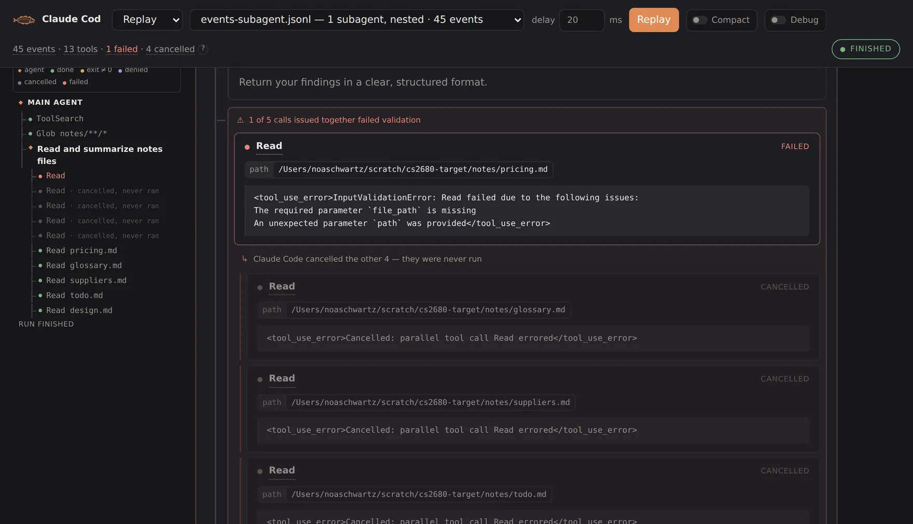

Two more ideas from the same project. A run blocked by refused permissions can be approved in
the page and resumed in the same session (**Approve and continue**). And subagents launched in
the background, whose events don't nest under their parent, each get a live status line with
the current action, tool count, tokens and time.

## What the agent meant to do

### Alexander Aghili: AIPatrol

Yide Bian's step headings use whatever the agent happens to say before it acts. Alexander
Aghili's AIPatrol asks for it: a custom prompt has the agent announce each logical unit of
work, and the page groups calls under those announcements, in the transcript and in the
outline. A finished task folds to one line with a count of its events, so a long session reads
as a short list of named steps. The outline's header counts calls and failures. Long outputs
keep their first and last lines, so the summary at the end of a test log survives the cut.

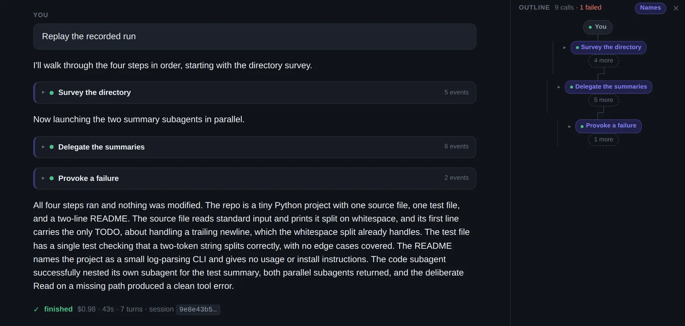

## Subagents as a team

### Djordje Ivanovic: Patchwork

Djordje Ivanovic's Patchwork turns subagents into characters, each with a name and an avatar,
and its Lanes view gives every agent a column. The lead's column reads like a delegation log:
an *Assigned* card for each task and who took it, then a *Result returned* card with the first
lines of each answer. Every subagent's column opens with "Assigned by Djordje" and closes with
the result it handed back. Runs of similar calls collapse into a phrase ("13 steps ·
Inspecting files · Read 13 files"), failures are pulled out under *Steps needing attention*,
and the panel is candid about how it treats time: "compact lanes, not elapsed time."

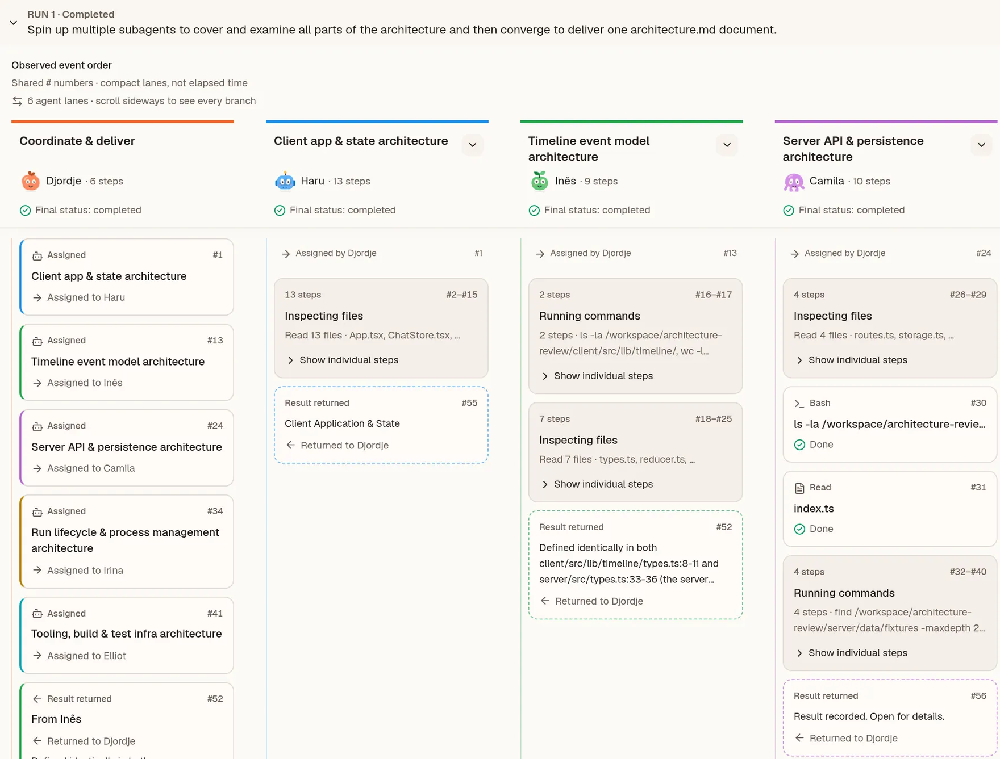

### Zoe Liu

Zoe Liu's viewer forks the log itself. When subagents run in parallel they get side-by-side
columns in the trajectory, each with its brief, step count and duration, and a subagent that
delegates again forks again inside its own column. The viewer is just as careful about how a
run ends. While a run streams, the header shows a lower bound on the cost (`≥$0.2496`) that
turns into the exact figure when the result arrives, and a stopped run says what it kept: "Run
stopped. Everything recorded before this point is kept."

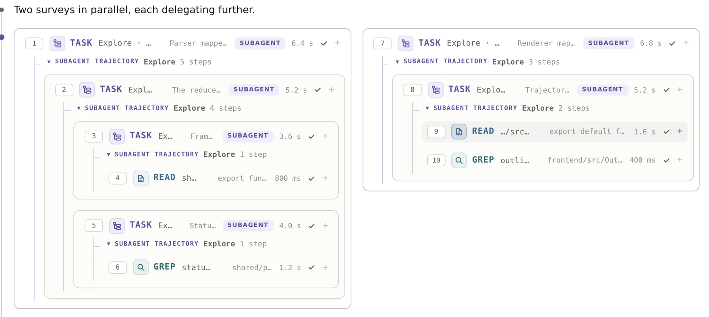

### Jack Fan: Trajectory

Jack Fan's Trajectory is the most restrained design here: a black page, a serif masthead, one
accent color. Prompts are diamonds on a thin rail, and every tool call is a single line with
the agent's own description and a duration. When the agent starts subagents in parallel, each
Agent row curves off into a lane of its own, so their work reads side by side with the
parent's. A running subagent shows its elapsed time against an estimate drawn from earlier
runs.

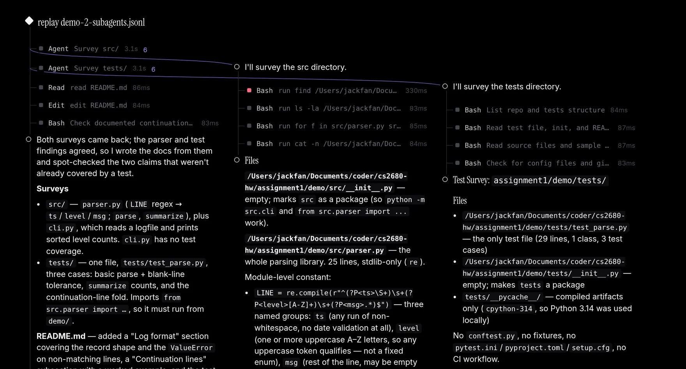

### Saul Richardson: Mission Control

Saul Richardson's Mission Control treats delegation as something to manage. Above the
conversation sits a strip of cards: the main session, then one card per delegate with its
status and current activity. Click a delegate and the whole view scopes to it, with its
assigned task, its activity, its numbers and its report. The composer spells out the rule:
"This replies to the session. A delegate is part of it and has no conversation of its own."

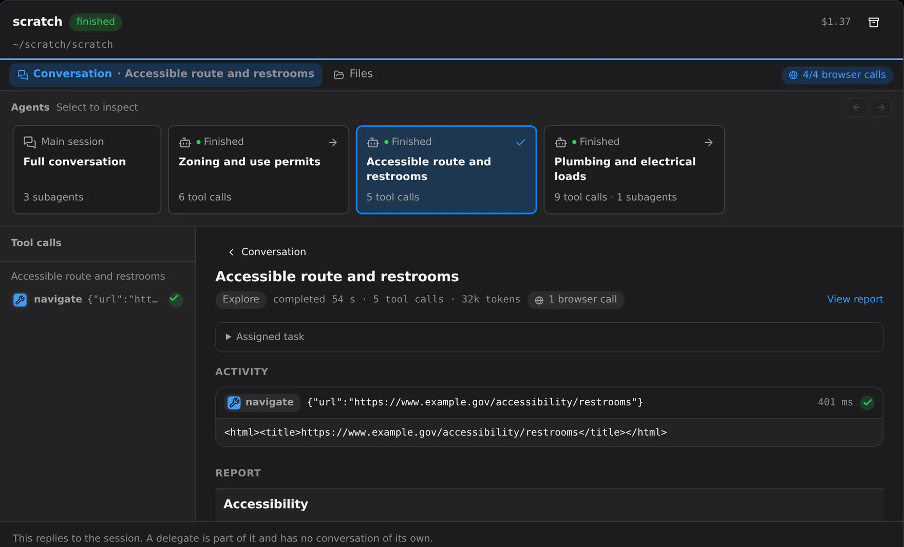

## A person in the loop

### Denny Cao

Run Claude Code headless and any tool call that needs permission is refused. Denny Cao's
viewer adds an "ask me" switch. With it on, the request appears in the page with **Approve**
and **Deny** buttons, and the run waits, its status reading "waiting on you", until someone
answers.

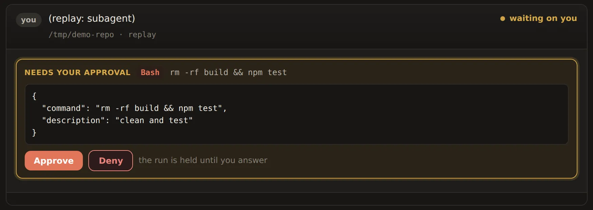

The same viewer answers the question everyone asks after a run: what did it change? Each run
gets a files-changed panel that diffs every touched file and labels it *agent* (an Edit or
Write in this run named the file), *run* (the file changed during the run, "most likely the
agent through Bash, but that is an argument from timing, not proof"), or *pre-existing*
("shown for context, not the agent's doing").

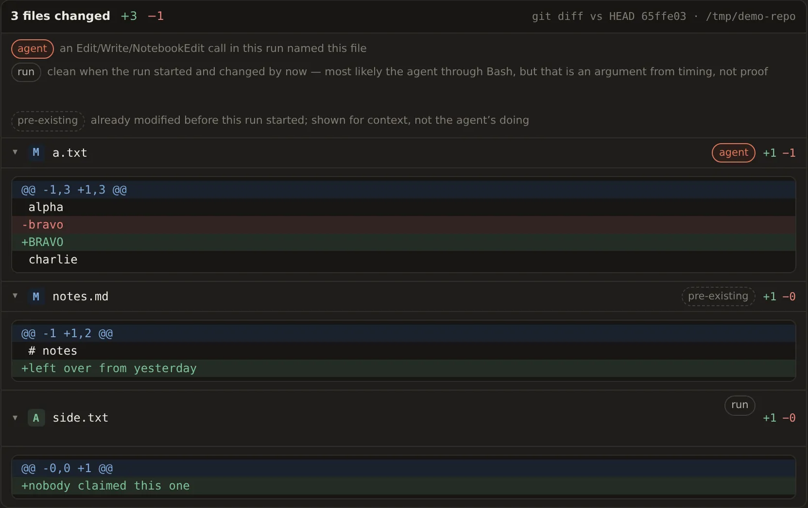

### Raul Romero: Controller

Raul Romero's Controller borrows from music hardware (the inspiration is Teenage Engineering):
an effort knob, keys for the model, a fader for the number of subagents, a delegation switch,
and LCD-style readouts for cost, time, turns and calls. Settings that usually live in a prompt
("use four subagents") become controls that stay in view. A radial scope on the right draws the
main agent as a hub with a satellite for each subagent, labelled with its call count.

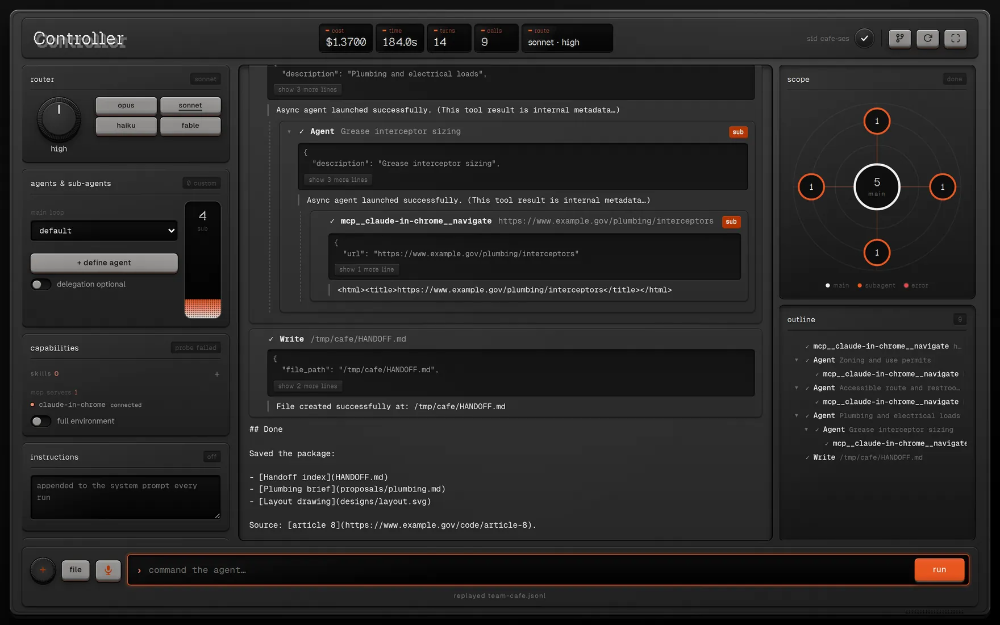

## Across the class

A few patterns from the rest of the designs:

- The most common additions were a Stop button, replay of recorded runs, permission controls
  and diffs of changed files.
- A real time axis was rare: only a handful of designs put calls on a clock.
- Many designs, independently, gave each running subagent a status line: what it is doing
  now, how many tools it has used, its tokens and its elapsed time. It's a small idea, and one
  of the most useful.
- Most designs drew the forking outline from the assignment's mockup. The ones above changed
  the main view instead.

If one of these designs is yours, think about writing it up as your Assignment 1 post. The
[publishing guide](/publish/) has the steps.

## How we chose these

We went through all 68 demo videos and write-ups with Claude's help. The narrated videos were
transcribed, and Claude stepped through each video two seconds at a time, writing a review of
each design that credited only what the video showed working. Three separate Claude
reviewers then compared the 25 strongest designs on one question: which would we most want to
show the class as a different or better way to watch or steer a coding agent? These eleven
came out on top. This post is a tour of their ideas, not a ranking, and plenty of designs not
shown here did one thing well.

The screenshots are not from the videos. Claude installed each of the eleven from its code and
replayed recorded runs, so no agent ran live. Where a project shipped no recording of its own,
we replayed one from another project, and two views were staged, as their captions say. Claude
also drafted this post.
