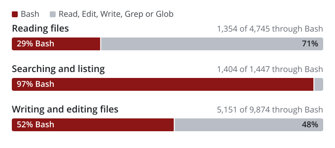
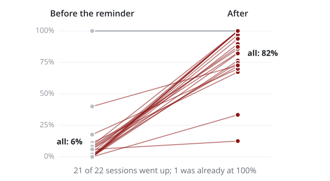

If you built a trajectory viewer for Assignment 1, you probably watched a lot of Bash go by.
Many students built careful renderers for Read, Edit and Write, expecting those tools to fill their
interfaces. Most of the file work arrived as `cat`, `sed -n`, heredocs and small Python patch
scripts, all wrapped in Bash cards. In one case described in our [lessons from the
assignment](/2026/assignment1/agentic-coding-lessons/), an agent completed an entire bug fix through
the shell without ever lighting up the student's edit view.

We initially suspected the model or the way students prompted it. The submitted session logs
pointed mostly to Claude Code itself: it told the agent to use the shell and removed the Bash
tool's usual warning against file operations. Most installations also lacked dedicated search
tools.

<!--more-->

## Where the file work went

Claude Code has Read, Edit and Write tools, and some installations also have Grep and Glob for
searching. The shell can do the same jobs: read with `cat` or `sed -n`, search with `grep` and
`find`, and write with a heredoc, `sed -i` or a short script. Across the build sessions of 61
students, Bash did one of these jobs 7,909 times.



Nearly all searches went through Bash, along with about half of writes and edits and a little
under a third of reads. The logs point to a system reminder, a change to the Bash tool description,
and missing search tools as the main causes.

## The bash-first reminder

In auto mode and bypass-permissions mode, Claude Code can add a system reminder to the
conversation. During the assignment, it used the following wording. We've added line breaks here
and in the other quoted passages:

```text
Do your work through the Bash tool wherever it can accomplish the job: read files
with cat, head, or sed -n, search with grep and find, and make file changes with
sed, heredocs, or short scripts, rather than using the dedicated Read, Edit, or
Write tools. Fall back to a dedicated tool only when Bash genuinely cannot do the
job.
```

Claude Code saves the reminder in the session transcript under `~/.claude/projects/`, as an
`auto_mode` record with `"bashFirst":true` and the exact text sent to the model. Of the 7,909 shell
calls, 88% happened with this reminder in the conversation.

Shell use was much higher in calls with the reminder in context than in sessions that never
received it (Figure 2).

 and with the reminder in the conversation (crimson).")

The fourth row is the most convincing to us because it compares sessions with themselves. In 22
sessions, the reminder appeared partway through, usually when the student switched to auto mode.
Shell reads and edits rose from 6% to 82% overall. The share increased in 21 of the 22 sessions;
the remaining session was already at 100%. One log makes the change easy to follow: the agent
made five changes with Edit and created a file with Write, then received the reminder. Its next
file operations were `sed -n` reads and Python patch scripts.



The reminder remains in the conversation after the student leaves the mode that triggered it.
Claude Code has an "Exited Auto Mode" notice directing the agent back to dedicated tools, but it
appeared only three times in our logs. When students prompted in default mode with an earlier
reminder still in context, 81% of reads and edits went through Bash. In default-mode sessions that
never received the reminder, the share was 9%.

Some agents explained this when students asked. One student asked why the agent had used `cat`
instead of Read; the agent cited the bypass-mode instruction to prefer Bash. A few others
mentioned a "Bash-first" default and said they would set it aside because the student had asked
for Read and Edit by name.

Our favorite example came from a student whose app showed only Bash cards in live runs. They asked
the agent to investigate. It found the reminder in the transcript and tried the same prompt under
two settings. With
`--dangerously-skip-permissions`, which puts the run in bypass mode, it used only Bash. With
`--permission-mode acceptEdits`, the reminder never appeared and it used Read, Edit and Write.
The agent also found why the app hadn't shown the instruction: the stream-json output these apps
consume omits the reminder.

## The warning that disappeared

Each model request includes a description of every tool. The Bash description normally contains
this warning:

```text
IMPORTANT: Avoid using this tool to run `cat`, `head`, `tail`, `sed`, `awk`, or
`echo` commands, unless explicitly instructed or after you have verified that a
dedicated tool cannot accomplish your task. Instead, use the appropriate dedicated
tool as this will provide a much better experience for the user.
```

The transcripts include snapshots of the system prompt and tool definitions sent to the model.
The warning appeared in 91 of the 96 snapshots without the reminder and was absent from 63 of the
67 snapshots with it. Claude Code was also removing the warning from the Bash description when
it added the reminder.

The general system prompt stayed the same. Every snapshot with the reminder still said "Prefer
the dedicated file/search tools over shell commands when one fits." The agent received both
instructions and followed the later, more specific one.

## Missing search tools

The missing search tools predate the reminder. The native macOS and Linux builds most students
used don't include Grep or Glob. Claude Code tells its Explore subagent to "Use `find` via Bash for
broad file pattern matching" and to "Use `grep` via Bash for searching file contents with regex."
Agents that tried Grep received this error:

```text
Error: No such tool available: Grep. Grep is not available in this session —
search file contents with `grep` via the Bash tool instead.
```

Across the assignment, agents called Grep and Glob 43 times. The tools worked for only three
students: one using an older command-line version, one on Windows, and one in a handful of
desktop-app sessions. Everyone else searched through Bash whether or not they had the reminder.

## Who gets the reminder

The reminder's presence and wording varied by model and Claude Code version in the assignment
logs:

- Almost every student whose main agent ran Opus 5 in auto or bypass mode got the text quoted above.
- Fable 5.1 sessions in those modes got it too.
- Opus 5.5 sessions, which only started after the deadline, got a gentler version: "You can do much
  of your work through the Bash tool when it is the simpler route … The choice is yours: prefer
  Edit or Write when a shell edit would be fragile."
- Sonnet 5 sessions never got it.
- Neither did sessions on older versions of Claude Code (2.1.215 and earlier, mostly running
  Sonnet 4 models).

Subagents follow the main session's setting, so Sonnet or Haiku subagents launched from an Opus 5
session received the reminder too. Claude Code also decides whether to include it when a session
starts. One session switched from Fable 5.1 to another model and kept the reminder.

Whether a session gets the reminder also depends on settings that Claude Code fetches from
Anthropic's servers. Two accounts running the same version can behave differently, and the
behavior can change without a software update. On October 5, an Opus 5 session in auto mode still
received the strict wording on the then-current release, 2.1.289.

## Why agents used the shell

Having the reminder in context doesn't establish whether Bash was useful for a particular call.
To examine that, we drew a random sample of 320 of the 7,909 calls: 100 reads, 80 searches and 140
writes or edits. Claude reviewer agents used a written codebook to read each call alongside the
student's prompt, the agent's recent messages and calls, the result, and what happened next. They
assigned the first reason in the list below that applied. A second review of 120 calls agreed
with the first on 95% of them. A separate blind check of 20 more matched 19.

![Reasons for using the shell in 320 sampled calls. Reading files (100 sampled calls): batching 17%, no dedicated tool 15%, no functional reason 57%, needed the shell 11%. Searching and listing (80 sampled calls): batching 1%, no dedicated tool 95%, no functional reason 1%, needed the shell 1%, other 1%. Writing and editing files (140 sampled calls): batching 67%, no dedicated tool 1%, no functional reason 13%, needed the shell 9%, other 9%. All 7,909 calls (weighted by job): batching 47%, no dedicated tool 20%, no functional reason 18%, needed the shell 8%, other 6%.](why-bash-reasons.svg "Figure 4. Why the shell was used, by the job the call did. Other covers calls that weren't really file jobs, plus the two where the student asked for the shell.")

We checked the reasons in this order:

| Reason | Share of all calls | What it typically looked like |
| --- | ---: | --- |
| Not really a file job | 6% | A test run whose only file change was a log file |
| The student asked for the shell | 1% | The prompt spelled out the command |
| Workaround after a file tool failed | 0% | Never seen |
| No dedicated tool | 20% | `grep -n "renderOutline" static/app.js`, or `find . -name "*.test.ts"` |
| Needed the shell | 8% | `jq` queries over a JSONL log, `tail -n 30 server.log`, a regex rewrite across files |
| Batching | 47% | A Python patch with several replacements, then `node --check app.js`, in one call |
| No functional reason | 18% | `sed -n '120,160p' src/server.js`, or a new file written with a heredoc |

The shares are weighted to all 7,909 calls. The commands are representative examples, not quotes
from student sessions.

In 318 of the 320 sampled calls, the student hadn't asked for the shell and nothing had gone
wrong. None immediately followed a failed call to a dedicated tool.

Almost half the calls batched a file change with a check, test run or server restart in one shell
command. This habit seems to accompany the reminder: in sessions without it, more than 90% of
edits used Edit or Write.

The calls classified as having no functional reason for Bash closely resembled the reminder's
examples. Of the 57 reads in that group, 43 used a single `sed -n` line range. Read with an offset
and a limit does the same job; `sed -n` is also one of the commands named in the reminder.

Reading through Bash can also make a later shell edit easier. Edit refuses to change a file the
agent hasn't opened with Read. Of the 69 sampled shell edits to existing files, 44 changed files
the agent had only read through the shell. Using Edit would have required an extra Read call;
staying in Bash skipped that step.

## What to do about it

If you're building an interface for agent runs, check the permission mode before rewriting your
prompts. Our assignment recommended `--dangerously-skip-permissions` for headless runs. That flag
selects bypass mode, so our advice turned on the reminder in many student apps. To encourage
Read, Edit and Write, use `--permission-mode acceptEdits` for headless runs, or approve tools with
`--allowedTools` instead of skipping permissions. Asking for tools by name also worked most of
the time in these logs: when students named Read or Edit, only 26 of 173 reads and edits still
went through Bash.

When reviewing an agent's work, inspect the changes in the working tree as well as the tool calls.
A shell edit doesn't return the structured patch you get from Edit.

Before comparing tool use across students, models or assignments, check which reminder each
session received. You can search your own logs with:

```bash
# sessions that received the reminder
grep -l '"bashFirst":true' ~/.claude/projects/*/*.jsonl
# sessions that received the gentler text
grep -l 'when it is the simpler route' ~/.claude/projects/*/*.jsonl
```

We don't know why Anthropic enabled this behavior. These logs also can't establish whether using
the shell improves or hurts the agent's work. They do explain much of the Bash use students saw:
the harness instructed the agent to use it. Tool-choice comparisons need to account for the
instructions each session received.

*This analysis uses the Assignment 1 build-session logs submitted by 61 CS2680 students, including
the recorded system reminders, prompt snapshots and tool definitions. All numbers are aggregates;
examples are anonymized and paraphrased. Claude (Opus 5.5, in Claude Code) drafted the post from
the course's session-log analysis, with prose revisions by ChatGPT.*
